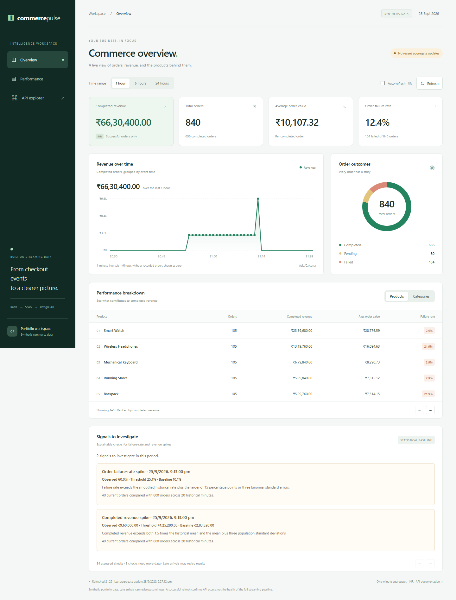
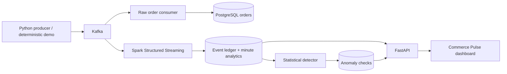

# Commerce Pulse

### Real-Time E-Commerce Intelligence

A runnable data-engineering portfolio project: synthetic orders flow through Kafka
and Spark into PostgreSQL, then become live analytics and explainable anomaly signals
in a FastAPI dashboard. Built to demonstrate correct accounting, replay-safe writes,
recovery, and evidence—not just connected technologies.



[Watch the 57-second dashboard walkthrough](docs/assets/commerce-pulse.webm)
(silent recording of the local synthetic demo).

**Python · Kafka · Spark Structured Streaming · PostgreSQL · FastAPI · Docker · SQL**

## Run the complete demo

Prerequisites: **Docker with Linux containers, Docker Compose v2, and Python 3.11+**.
Run from the repository root. No host Java, Spark, Node, or Python packages are needed.
The first build needs internet access for pinned images, packages, and Spark's connector.

```shell
python scripts/manage.py demo
```

Open **[localhost:8000](http://localhost:8000/)**. The command builds and starts the
stack, sends 840 labeled synthetic orders through Kafka, verifies both database
paths and two anomaly signals, and checks API readiness. Choose **1 hour** in the
dashboard to inspect the demo's twenty-minute baseline and injected spike.

The same command replays the same event IDs on subsequent runs. Use
`python scripts/manage.py demo --new` for a new history. Demo data is retained;
all names, transactions, and alerts are synthetic. No external account is needed.

```shell
python scripts/manage.py check                # Unit + PostgreSQL + Spark + API + reconciliation
python scripts/manage.py recovery             # Kill Spark, queue duplicates, restart and verify
python scripts/manage.py benchmark            # 300 orders at a target 20 orders/second
python scripts/manage.py stop                 # Stop without deleting data
```

See the [runbook](docs/runbook.md) for live generation, browser tests, alternate ports,
existing-data setup, startup troubleshooting, and expected output.

## What it demonstrates

- **Reliable ingestion:** acknowledged producer writes; a database consumer commits
  offsets only after saving an order.
- **Replay-safe analytics:** unique event ledger and minute aggregate updates commit
  in the same PostgreSQL transaction. Replayed IDs cannot inflate totals.
- **Event-time reporting:** revenue, order counts, weighted AOV, and failure rates
  by minute, product, and category. Late events revise their original minute.
- **Serving:** read-only APIs with bounded queries, explicit time semantics,
  pagination, decimal values, and health checks.
- **Usable dashboard:** responsive charts, outcome distribution, product/category
  tables, freshness indicators, error recovery, and evidence-backed anomaly cards.
- **Explainable detection:** failure-rate and revenue spike rules with explicit
  minimum sample sizes. Insufficient data is not presented as a healthy result.



## Verification and measured evidence

The [validation report](docs/validation.md) records the tested environment, actual
throughput/latency measurements, crash recovery, and limitations. Raw reports are
in [docs/evidence](docs/evidence), with commands to reproduce each result.

[GitHub Actions](.github/workflows/ci.yml) runs a clean demo, integration tests,
Spark checks, crash recovery, a small benchmark, and browser tests. It uploads logs,
JSON reports, and screenshots. The workflow is provided locally; hosted execution
must be confirmed after the repository is pushed to GitHub. No CI badge is claimed.

## Project map

| Directory | Responsibility |
| --- | --- |
| `producer/` | Synthetic order generation and raw PostgreSQL ingestion |
| `streaming/` | Spark parsing, validation, deduplication ledger, minute aggregation |
| `api/` | FastAPI endpoints and dependency-free dashboard assets |
| `detection/` | Statistical rules, worker, synthetic evaluation |
| `scripts/` | Setup, deterministic demo, reconciliation, benchmark, recovery |
| `tests/` | Unit, live pipeline, and browser checks |
| `docs/` | Architecture decisions, runbook, evidence, interview/demo materials |

## Scope and honest limits

This is a **single-node portfolio system**, not a production deployment. Spark's
sink stages bounded batches through the driver and serializes database writers.
The retained event ledger grows over time; no automatic retention policy is applied.
Invalid events are counted but do not yet have a durable quarantine sink. Order
updates/refunds, authentication, high availability, and a trained ML model are out
of scope for this version. Synthetic detector scores are sanity checks, not estimates
of real-world accuracy. Performance evidence is a small paced run, not a capacity claim.

Read the [architecture decisions](docs/architecture.md), [API and detector reference](docs/reference.md),
[demo script and CV bullets](docs/portfolio.md), and [validation report](docs/validation.md).
