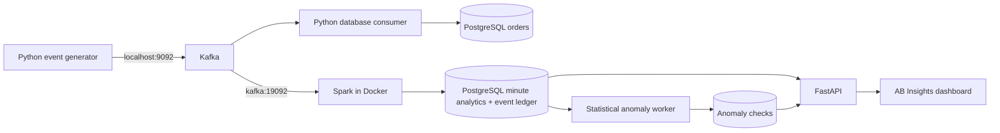

# Detailed API, analytics, and detector reference

For the supported one-command setup, use the [runbook](runbook.md). This reference
also includes optional host development commands and historical milestone notes.

A portfolio project exploring reliable event ingestion, streaming analytics, and
operational visibility for a simulated Indian e-commerce business. All customer
and transaction data is synthetic; amounts are INR.

## Current architecture



Spark persists completed revenue, completed order count, average completed
order value, failed order count, and failure rate, overall and by category/product.
Failure rate uses all valid orders as the denominator, including pending orders.
Metrics accumulate in one-minute UTC event-time windows in `analytics_minute`.
Invalid events are counted and excluded; a durable quarantine sink is planned.

## Run locally (PowerShell)

Prerequisites: Python 3.11 and Docker Desktop with its Linux engine running. Spark
runs in Docker: no Windows Hadoop or winutils installation is required.

```powershell
python -m venv .venv
.\.venv\Scripts\python.exe -m pip install -r requirements.txt
# Only copy .env.example when no .env already exists.
docker compose config --quiet
docker compose up -d kafka postgres
docker compose up -d --build spark
docker compose up -d --build api
docker compose up -d --build detector
docker compose logs -f spark
```

For host producer development (the raw database consumer now runs in Compose):

```powershell
.\.venv\Scripts\python.exe -m producer.event_generator
```

Compose reads `.env`; Python scripts read process environment variables, with
matching local development defaults. If changing credentials, set
`$env:POSTGRES_PASSWORD = 'your-local-password'` in the consumer terminal too.
Supported variables: `KAFKA_BOOTSTRAP_SERVERS`, `KAFKA_TOPIC`, `POSTGRES_DB`,
`POSTGRES_USER`, `POSTGRES_PASSWORD`, `POSTGRES_HOST`, `POSTGRES_PORT`.
The default credentials and plaintext listeners are for local development.

Kafka advertises `localhost:9092` to host clients and `kafka:19092` to containers.
Spark waits for Kafka health and a one-shot service that creates `ecommerce-orders`
if absent (three partitions on a fresh broker). It downloads its matching 4.2.0 Kafka connector into
`/tmp/.ivy2` on first startup; internet access is required. Checkpoints are retained
under `runtime/spark-checkpoints/analytics-v1`. This new checkpoint replays retained
Kafka history into the new analytics tables; it does not backfill the legacy `orders`
table. `earliest` applies only when no checkpoint exists.
Do not reuse old checkpoints after changing the query structure or replacing Kafka
history. Kafka 4.3.1 is pinned by image digest. New checkouts use initialized Docker
named volumes for Kafka and checkpoints. The original workspace's gitignored `.env`
preserves its existing bind-mounted data; see the runbook before changing storage.

PostgreSQL retains the existing `postgres_data` volume and table schema. Changing
`.env` credentials does not change users/passwords in an initialized database.
`docker compose stop` stops services without deleting data. Avoid `down -v` when
you want to retain PostgreSQL data.

## Verify

```powershell
.\.venv\Scripts\python.exe -m unittest discover -s tests -v
.\.venv\Scripts\python.exe tests/smoke_pipeline.py
docker compose run --rm --no-deps spark /opt/spark/bin/spark-submit /opt/spark-apps/test_analytics.py
docker compose run --rm --no-deps spark /opt/spark/bin/spark-submit /opt/spark-apps/test_persistence.py
.\.venv\Scripts\python.exe tests/smoke_analytics.py
Get-Content tests/reconcile_analytics.sql | docker compose exec -T postgres psql -v ON_ERROR_STOP=1 -U ecommerce_user -d ecommerce
docker compose ps
docker compose exec postgres psql -U ecommerce_user -d ecommerce -c "SELECT COUNT(*) FROM orders;"
docker compose logs --tail 100 spark
```

The smoke test requires running Kafka and PostgreSQL, adds three synthetic orders,
and briefly runs the database consumer. Stop other instances of that consumer first.
It retains the test orders and writes diagnostic output to `runtime/smoke-consumer.log`.
The Spark test uses controlled valid, malformed, failed, and pending records to
check validation and revenue semantics. The generator test needs no broker.
Persistence tests use a temporary PostgreSQL schema that is removed afterward.
They check duplicate delivery within/across batches, writer reconnection, late
events, minute boundaries, UTC offsets, invalid events, conflicting IDs, and
rollback after an injected failure between aggregate writes and commit.
The live analytics smoke test requires the full stack, restarts Spark, and retains
four uniquely labeled synthetic orders. It checks duplicate delivery and replay
across a real restart, followed by a late event in the same minute.
The reconciliation query independently recomputes every metric in SQL from the
event ledger: zero returned rows means all stored windows and dimensions match.

## Query durable analytics

### Dashboard

Open **http://localhost:8000/** after starting the API. AB Insights is a responsive
dashboard served by FastAPI, with no Node build, external fonts, or chart CDN required.
It shows completed revenue, order counts, AOV, failure rate, revenue trends, order
outcomes, and paginated product/category performance. Select 1, 6, or 24 hours;
auto-refresh runs every 15 seconds while the page is visible and can be paused.

Charts use your browser's timezone and aggregate all returned minute pages into
1-, 5-, or 15-minute display intervals. Missing recorded minutes are plotted as zero;
this does not prove that ingestion was healthy. Amounts are rounded for display;
the API retains decimal precision. Separate API requests are not a single database
snapshot, so a live write can briefly cause differences between panels.

The freshness badge uses aggregate update time: no update for two minutes produces
an amber indicator, even when the API is reachable. Refresh failures preserve the
last successful view with an explicit warning; empty data is distinguished from
unavailable data. Start the generator in a separate terminal to see new activity:

```powershell
.\.venv\Scripts\python.exe -m producer.event_generator
```

Browser verification (API must be running):

```powershell
.\.venv\Scripts\python.exe -m pip install -r tests/requirements-browser.txt
.\.venv\Scripts\python.exe tests/dashboard_smoke.py
```

Tests use installed Edge on Windows. Elsewhere install Chromium with
`python -m playwright install chromium`; `BROWSER_CHANNEL` can override the browser.
Seven browser tests cover real desktop/mobile rendering, filters, pagination,
complete chart page loading, safe product-name rendering, empty results, API
failure, recovery, alert evidence/pagination, and insufficient baseline states.
Browser-only fixtures do not write to the database.
Real-data screenshots are saved to `runtime/dashboard/desktop.png` and `mobile.png`.

### API and SQL

The read-only API is available at **http://localhost:8000/docs**, with an OpenAPI
schema at `/openapi.json`. It binds to localhost in Compose. Endpoints:

| Endpoint | Purpose |
| --- | --- |
| `GET /health/live` | Process liveness, independent of PostgreSQL |
| `GET /health/ready` | PostgreSQL reachable and analytics table available |
| `GET /api/v1/metrics/summary` | Totals across minutes; weighted AOV and failure rate |
| `GET /api/v1/metrics/windows` | Minute rows, optionally filtered by category/product |
| `GET /api/v1/metrics/breakdown` | Category/product totals ranked by completed revenue |
| `GET /api/v1/anomalies` | Flagged checks with observed value, threshold, and baseline evidence |

```powershell
Invoke-RestMethod 'http://localhost:8000/api/v1/metrics/summary'
Invoke-RestMethod 'http://localhost:8000/api/v1/metrics/windows?dimension=product&limit=10'
Invoke-RestMethod 'http://localhost:8000/api/v1/metrics/breakdown?dimension=category'
```

All analytics endpoints accept `start` (inclusive) and `end` (exclusive) timestamps
with explicit timezone offsets and minute precision. The default covers 24 hours
ending at the next UTC minute, including the current incomplete minute. Ranges must
be positive and at most 31 days. Encode `+` as `%2B` when putting an offset in a URL.
The windows endpoint accepts `dimension=all|category|product` and optional exact
`dimension_value` for product/category. Breakdown accepts category or product.

Pages return `items`, `limit`, `offset`, and `has_more`; limits are 1–500 and offsets
0–100,000. Windows sort newest first with dimension value as a tie-breaker; breakdowns
sort by revenue descending, then name. Pagination is deterministic per request but
not a snapshot across requests: live updates can change ranking while browsing.

Monetary values and rates are JSON **decimal strings**, preserving precision.
Currency is INR. Empty summaries return zero counts/revenue, null AOV/rate, and null
`last_updated`; pages return an empty list. `last_updated` is the latest database
aggregate update in the selected data, not proof of stream health. Readiness does
not claim Kafka or Spark is healthy, or that data is fresh. Missing analytics tables
or database failures return HTTP 503; invalid query parameters return HTTP 422.

The API opens a read-only database transaction per request, with five-second
connection and SQL timeouts. It exposes aggregate data only. Authentication,
connection pooling, and deployment hardening remain future work.

For local API development and tests (PostgreSQL must be running):

```powershell
.\.venv\Scripts\python.exe -m pip install -r api/requirements-dev.txt
.\.venv\Scripts\python.exe -m unittest discover -s api/tests -v
# Stop the Compose API first if you want the host process to use the same port.
.\.venv\Scripts\python.exe -m uvicorn api.main:app --reload
```

API integration tests create an isolated temporary schema, exercise real PostgreSQL
queries through FastAPI's TestClient, then remove that schema. They cover weighted
metrics, time boundaries, pagination, SQL parameter binding, empty data, validation,
and database failure responses. See [FastAPI testing documentation](https://fastapi.tiangolo.com/reference/testclient/).

```sql
SELECT window_start, order_count, completed_order_count, completed_revenue,
       average_order_value, failed_order_count, failed_order_rate
FROM analytics_minute
WHERE dimension = 'all'
ORDER BY window_start DESC
LIMIT 20;
```

Use `dimension = 'product'` or `'category'` and `dimension_value` for breakdowns.
Do not sum across dimensions: each event contributes to all three views. Windows
are half-open: an event at 12:01:00 belongs to [12:01:00, 12:02:00).
Average order value is NULL when a window has no completed orders. Empty minutes
have no row. Rates are fractions (0.25 means 25%).

Spark calculates minute deltas only for new event IDs. PostgreSQL inserts these IDs
into `analytics_events` and adds their deltas to `analytics_minute` in one transaction.
An advisory transaction lock serializes analytics writers. Failure before commit
rolls everything back; failure after commit is safe to replay because those IDs
are already present. Generated columns derive averages/rates from cumulative sums
and counts, avoiding incorrect averages of batch averages.

Late events revise their original minute without a lateness cutoff. There is no
watermark or claim that a minute is final. Deduplication state lives in PostgreSQL,
so it survives checkpoint replacement but grows with event history. Do not prune
the ledger independently of your replay/retention policy. Reused IDs with changed
analytics fields stop the batch for investigation; updates/refunds need a future
versioned event contract.

## Explainable anomaly detection

The `detector` service reads overall minute aggregates every 30 seconds and writes
`anomaly_checks` plus a `detector_status` heartbeat. The dashboard's **Signals to
investigate** panel shows flagged checks and their evidence. This is a versioned
statistical heuristic (`statistical-v1`), not a trained ML model or a calibrated
statistical significance test. A spike is a prompt to investigate, not proof of
fraud or an outage.

Each minute is compared with active minute rows in the **preceding 60 minutes**,
excluding the target and all future data. Both rules require at least five
historical minute rows, 100 historical orders, and ten orders in the target minute.
Otherwise the result is `insufficient_data`, not `normal`.

| Rule | Observed value | Alert threshold (strictly exceeded) |
| --- | --- | --- |
| Failure-rate spike | Failed / all orders, including pending | `p + max(0.15, 3 * sqrt(p * (1-p) / n))`, capped at 1; `p = (historical failures + 1) / (historical orders + 2)` |
| Revenue spike | Completed INR revenue in the minute | Larger of `1.5 * historical mean` and `historical mean + 3 * population standard deviation` |

Revenue detection also requires a positive baseline mean. Missing minutes are not
imputed as zero, because absence of records can mean missing ingestion rather than
no demand. Low revenue/no-traffic alerts are intentionally deferred until pipeline
health can distinguish these situations. Seasonality, changing volume, and ongoing
incidents can distort the baseline; a future ML comparison needs richer labeled data.

Evaluation waits two minutes after a minute ends, then occurs on the next worker
poll (nominally up to another 30 seconds, excluding processing time). This is a
configured delay, **not a measured latency guarantee**. Each poll recomputes the
last 24 hours from a consistent database snapshot, allowing late events to revise
both the target minute and its baseline. Older verdicts remain historical snapshots;
they are not recomputed after this horizon. No automatic retention cleanup exists yet.

Checks are upserted by `(window_start, detector, detector_version)`, making reruns
idempotent. A revised result can move from flagged to normal or insufficient data;
`first_flagged_at` remains available. This stores the latest verdict, not a full
incident audit trail. The worker retries database failures and records its heartbeat
only after a successful transaction. The dashboard flags heartbeats older than
90 seconds and keeps commerce metrics usable if the detector is unavailable.

`GET /api/v1/anomalies` supports the same minute-aligned `start`, `end`, `limit`, and
`offset` parameters as the metrics API, plus `status=flagged|normal|insufficient_data|all`.
Default status is flagged. Counts describe **detector checks** (two per assessed
minute), not distinct minutes. Thresholds and observed values are floating-point
statistics; use `unit` to distinguish fractions from INR. Existing analytics history
is small, so the real dashboard may correctly report that it is building a baseline.

```powershell
.\.venv\Scripts\python.exe -m unittest discover -s tests -v
.\.venv\Scripts\python.exe -m unittest discover -s detection -p test_integration.py -v
.\.venv\Scripts\python.exe -m detection.evaluate
docker compose logs --tail 20 detector
Invoke-RestMethod 'http://localhost:8000/api/v1/anomalies?status=all'
```

The integration tests require the API development dependencies and running PostgreSQL;
they create and remove isolated schemas. They test persisted flags, idempotent reruns,
late-data revisions, delay eligibility, API evidence/pagination, and unavailable detection.
Pure tests cover known normal/spike cases, minimum sample sizes, threshold boundaries,
and prevention of future-data leakage. Browser fixtures verify safe alert rendering.

The reproducible synthetic evaluation (seed 20260925) writes
`runtime/evaluation/anomalies.json`. On 200 deliberately easy scenarios per detector,
each rule found 100 injected spikes with zero false positives or false negatives
(precision/recall 1.0). **These are sanity checks, not real-world accuracy results**:
the scenarios use independent histories, large spikes, and no drift or seasonality.
No injected benchmark orders are written into the live commerce database.

## Reliability and limitations

- The producer waits for broker acknowledgement before reporting success.
- The database consumer commits only the saved record's Kafka offset after the
  database transaction commits. Replay is safe through `event_id` uniqueness and
  `ON CONFLICT DO NOTHING`; this is at-least-once delivery with idempotent insertion.
- Database errors stop ingestion rather than acknowledge unsaved records. Poison
  messages still require operator intervention; retries/quarantine are planned.
- New generated timestamps include UTC offsets. Legacy naive timestamps are
  interpreted as UTC by Spark; historical local timestamps need explicit migration
  before mixing them into event-time reports.
- Spark's sink handles at most 10,000 source records per trigger and moves validated
  records through the driver into a PostgreSQL staging table. It holds a database
  transaction during Spark aggregation. This is deliberately a modest-scale design;
  throughput testing and distributed staging are needed before scaling it up.
- The generator treats each event as an independent order snapshot. Status changes,
  refunds, and order lifecycle accounting are not yet modeled.
- This is a single-node development system, not a production deployment.

## Portfolio roadmap and evidence

Verified locally on 2026-09-25: generator unit test, Spark validation/revenue test
in Docker, and live host producer to Kafka to PostgreSQL smoke test (3/3 new orders).
The original 63 PostgreSQL rows remained intact; the smoke run increased this to 66.
Spark also consumed those three events through the internal listener and reported
two completed orders, INR 9,093 completed revenue, INR 4,546.50 average order value,
and one failed order (33.33%). Kafka and PostgreSQL were healthy and Spark remained
running after the batch. These figures validate the test data, not performance.

The durable-analytics milestone passed three PostgreSQL integration tests and a
live Kafka/Spark restart test. Duplicate delivery, replay after restart, and a late
event produced exactly four unique test orders, INR 600 completed revenue, INR 300
average order value, and a 25% failure rate. Tests preserve the existing `orders`
table; analytics backfill covers only events still retained in Kafka.

The API milestone passed eight PostgreSQL integration tests. Live summary, windows,
breakdown, Swagger UI, and OpenAPI requests succeeded; the API container is healthy.
The verified summary of the retained seven analytics events was INR 9,693 revenue
and four completed orders. This is a smaller history than the 66 legacy `orders`
rows because only retained Kafka events were backfilled into analytics.
The dashboard milestone passed five headless browser tests plus all eight API
regression tests. Desktop and phone screenshots were visually reviewed against
the live data; no additional synthetic records were inserted for this UI milestone.

1. **Reliable ingestion:** extend the smoke test to automatically assert Spark output;
   test replay after a consumer crash and record the result.
2. **Analytics hardening:** version the event contract, quarantine invalid events,
   and define a retention/finalization policy for late data and the deduplication ledger.
3. **Dashboard enhancements:** add drill-downs and export, then distinguish actual
   stream lag from periods with no new orders using pipeline instrumentation.
4. **Operational evidence:** CI, structured logs, throughput/latency measurements,
   restart recovery demo, and an architecture decision log. Publish measured values
   with hardware and workload details, not unsupported performance claims.
5. **ML comparison:** extend the tested statistical baseline with harder labeled
   scenarios, seasonality and drift; compare a trained model on held-out data using
   precision, recall and measured detection delay. Add orchestration only when
   scheduled workloads justify it.

The finished portfolio should include a reproducible demo, screenshots, a short
walkthrough, documented tradeoffs, and test/benchmark results that can be defended
in an interview.

Reference: [Apache Spark Kafka integration](https://spark.apache.org/docs/latest/streaming/structured-streaming-kafka-integration.html).
